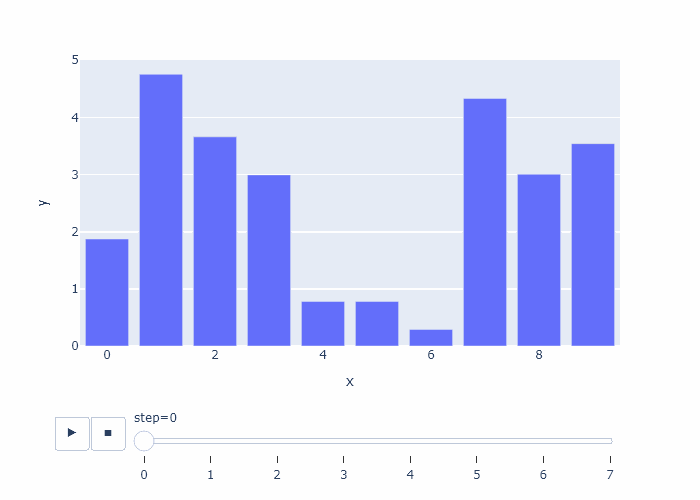

# Plotly Express GIF Generator

This Python package provides a simple and effective way to generate GIF animations from [Plotly Express animations](https://plotly.com/python/animations/). Utilizing the `generate_gif` function within the `gif_animation_plotly.py` file, users can effortlessly transform their dynamic Plotly charts into GIFs, suitable for presentations, educational content, and web usage.

## Installation

To use this package, clone the repository to your local machine and install the required dependencies listed in `requirements.txt`.

```bash
git clone https://github.com/<your-username>/plotly-express-gif-generator.git
cd plotly-express-gif-generator
pip install -r requirements.txt
```

**Important:** This package uses a specific version of the `kaleido` library (`kaleido==0.1.0.post1`) from `requirements.txt` to address a common issue where the `.to_image()` method stucks on Windows systems.

## Usage

To generate a GIF from a Plotly Express animation, follow these steps:

1. Navigate to the repository's root directory.
2. Run the `main.py` script.

```bash
python main.py
```

You can modify `main.py` to include your Plotly Express animation code. An example usage of the `generate_gif` function is provided within `main.py`.

### Example

```python
import plotly.express as px
import pandas as pd
import numpy as np

import gif_animation_plotly


r = np.random.RandomState(42)

# sample data
df = pd.DataFrame(
    {
        "step": np.repeat(np.arange(0, 8), 10),
        "x": np.tile(np.linspace(0, 9, 10), 8),
        "y": r.uniform(0, 5, 80),
    }
)

# plotly animated figure
fig = px.bar(df, x="x", y="y", animation_frame="step")

gif_animation_plotly.generate_gif(figure=fig, filename="example.gif")
```

Replace the `fig` variable with your Plotly Express figure to create a customized animation.

## Example of a generated GIF

